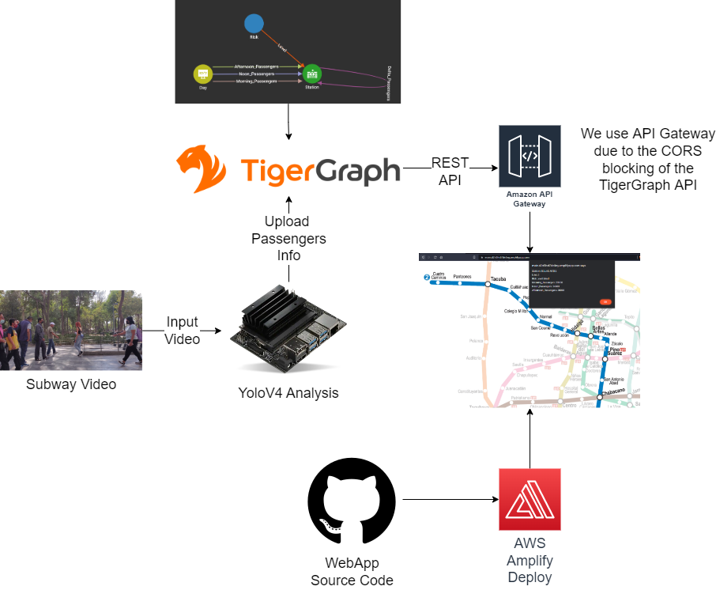
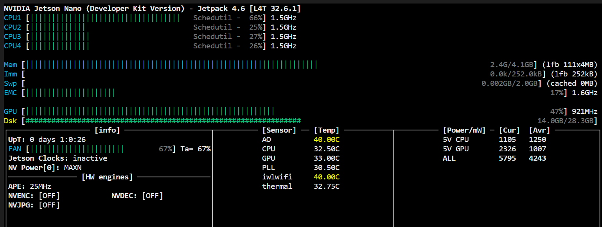

# TAI

# Introduction:

# Solution:

WEBPAGE: https://main.d2n5hct7dn6ny.amplifyapp.com/

TAI is a platform based on a Scalable Graph Database which, through IoT and artificial intelligence, seeks to improve passenger management in the subway and reduce the risk of contagion of diseases such as COVID-19.

With this application we can obtain risk indices for passenger density at each station and, in turn, better manage user routes through the subway. Just by clicking on any of the stations we will obtain real-time information about it.

The people count in each of the stations is done in real time through our AIoT device and sending the data to TigerGraph thanks to the Python SDK.

# System's Architecture:

- The system first requires that there is continuous video input to the jetson nano
- People counting is done through the YoloV4 neural network in the jetson.
- Through the TigerGraph Python SDK we send the passenger count data to our database.
- From the TigerGraph RestAPI we wanted to consume the stored data, but due to the CORS block, we had to bypass it through the Amazon API Gateway.
- On the website we display the data as an interactive map.
- The deployment of the web page is done by reading the source code from a repository to the AWS Amplify deployment service.

# Usecase:

In this case, the Mexico City Subway system is used as an example for our project.

Specifically line 2, which we can see highlighted in the following diagram.

In turn, as can be seen in the image, it is one of the most important in the city, due to its concurrence with the others.

# Graphs:

Due to the fact that the graphical DB have as real value the interactions between their Vertex and Edges, we create the following basic scheme.

Once the DB was populated with real data from the Mexico City Subway, we obtained the following results.

- The number of passengers according to the operating hours of the subway in a station.

- Or even see the people who use the entire subway line at a given time.

- The number of passengers that each of the stations share with each other, which tells us which stations usually have more passengers getting off or getting on.

- Here is an example of passengers passing from one station to another.

In addition to knowing the number of passengers that the line shares with each other, we can extrapolate the risk of using a particular station due to the density of passengers.

The risk classification is High, Med and Low.

- High Risk:

- Low Risk:

All this information is available in real time on our website. Clicking on any of the Line 2 stations.

WEBPAGE: https://main.d2n5hct7dn6ny.amplifyapp.com/

# Loading Jobs:

In order to upload the data from Jetson with the Python SDK, the following loading jobs were created.

- Add New Day:

        USE GRAPH Subway
        BEGIN
        CREATE LOADING JOB load_day FOR GRAPH Subway {
        DEFINE FILENAME MyDataSource;
        LOAD MyDataSource TO VERTEX Day VALUES($0, $1, $2) USING SEPARATOR=",", HEADER="true", EOL="\\n";
        }
        END

- Add Passengers:

        USE GRAPH Subway
        BEGIN
        CREATE LOADING JOB load_n_p FOR GRAPH Subway {
        DEFINE FILENAME MyDataSource;
        LOAD MyDataSource TO EDGE Passengers VALUES($0, $1, $2) USING SEPARATOR=",", HEADER="true", EOL="\\n";
        }
        END

- Add Delta Passengers:

        USE GRAPH Subway
        BEGIN
        CREATE LOADING JOB load_delta FOR GRAPH Subway {
        DEFINE FILENAME MyDataSource;
        LOAD MyDataSource TO EDGE Delta_Passengers VALUES($0, $1, $2) USING SEPARATOR=",", HEADER="true", EOL="\\n";
        }
        END

- Add Risk Level:

        USE GRAPH Subway
        BEGIN
        CREATE LOADING JOB load_level FOR GRAPH Subway {
        DEFINE FILENAME MyDataSource;
        LOAD MyDataSource TO EDGE Level VALUES($0, $1, $2) USING SEPARATOR=",", HEADER="true", EOL="\\n";
        }
        END

# AI Analysis:

The analysis of the Jetson nano is done using the model of [YoloV4](https://pjreddie.com/darknet/yolo/), this neural network is optimized for use with the Jetson Nano, the code is in the following folder [Main Code](./Jetson%20Nano/Main%20Code/). 

Here some statistics of the use of the Jetson.

You can try the people recognition code on the following notebook.
[Notebook](./Jetson%20Nano/Test/YoloV4.ipynb)
