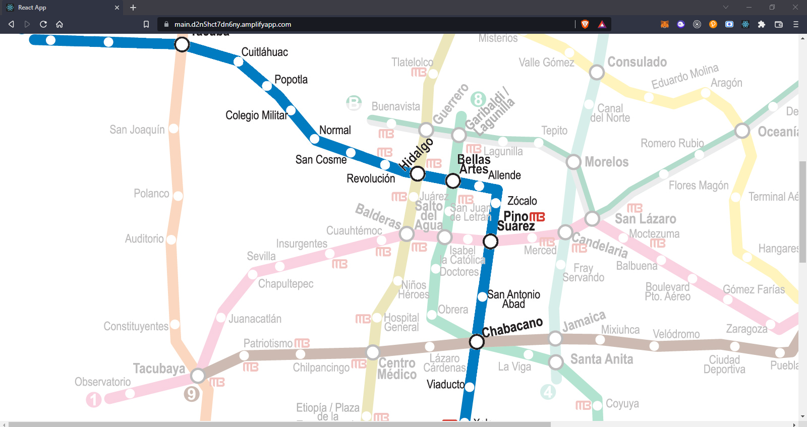

# TAI

# Introduction:

# Solution:

WEBPAGE: https://main.d2n5hct7dn6ny.amplifyapp.com/

TAI es una plataforma basada en una Scalable Graph Database la cual mediante IoT y Inteligencia artificial busca mejorar la gestion de pasajeros en el subway y disminuir el riesgo de contagio de enfermedades como el COVID-19.

Con esta aplicacion podemos obtener indices de riesgo por densidad de pasajeros en cada estacion y a su vez gestionar mejor las rutas de los usuarios por el subway. Tan solo al hacer clic en cualquiera de las estaciones obtendremos informacion a tiempo real de la misma.

El conteo de gente en cada una de las estaciones se realiza en tiempo real mediante nuestro dispositivo de AIoT y mandando los datos a TigerGraph gracias al Python SDK.

# System's Architecture:

# Usecase:

En este caso se utilizo de ejemplo para nuestro proyetco el sistema de Subway de la ciudad de mexico.

En especifico la linea 2, la cual podemos ver remarcada en el siquiente esquema.

a su vez como se puede ver en la imagen es una de las mas importantes en la ciudad, debido a su conrurrencia con las demas.

# Graphs:

Debido a que las DB graficas tienen como valor real las interacciones entre sus Vertex y Edges, creamos el siguiente esquema basico.

Una vez pobrada la DB con datos reales de el Subway de la ciudad de mexico, obtuvimos los siguientes resultados.

- La cantidad de pasajeros segun el horario de funcionamiento del subway en una estacion.

- O inclusive ver las personas que usan toda la linea del metro en un momento determinado.

- La cantidad de pasajeros que cada una de las estaciones comparte entre si, lo cual nos indica que estaciones suelen tener mas pasajeros que bajen o que suban.

- Aqui un ejemplo de los pasajeros que pasan de una estacion a otra.

Ademas al saber la cantidad de pasajeros que la linea comparte entre si, podemos extrapolar el riesgo de usar una estacion en concreto debido a la densidad de pasajeros. 

La clasificacion de el riesgo es High, Med and Low.

- High Risk:

- Low Risk:

Toda esta informacion esta disponible en tiempo real en nuestra pagina web. Al hacer clic en cualquiera de la estaciones de la Linea 2.

WEBPAGE: https://main.d2n5hct7dn6ny.amplifyapp.com/

# Loading Jobs:

Para Poder subir los datos desde la Jetson con el Python SDK se crearon los siguientes loading jobs.

- Add New Day:

        USE GRAPH Subway
        BEGIN
        CREATE LOADING JOB load_day FOR GRAPH Subway {
        DEFINE FILENAME MyDataSource;
        LOAD MyDataSource TO VERTEX Day VALUES($0, $1, $2) USING SEPARATOR=",", HEADER="true", EOL="\\n";
        }
        END

- Add Passengers:

        USE GRAPH Subway
        BEGIN
        CREATE LOADING JOB load_n_p FOR GRAPH Subway {
        DEFINE FILENAME MyDataSource;
        LOAD MyDataSource TO EDGE Passengers VALUES($0, $1, $2) USING SEPARATOR=",", HEADER="true", EOL="\\n";
        }
        END

- Add Delta Passengers:

        USE GRAPH Subway
        BEGIN
        CREATE LOADING JOB load_delta FOR GRAPH Subway {
        DEFINE FILENAME MyDataSource;
        LOAD MyDataSource TO EDGE Delta_Passengers VALUES($0, $1, $2) USING SEPARATOR=",", HEADER="true", EOL="\\n";
        }
        END

- Add Risk Level:

        USE GRAPH Subway
        BEGIN
        CREATE LOADING JOB load_level FOR GRAPH Subway {
        DEFINE FILENAME MyDataSource;
        LOAD MyDataSource TO EDGE Level VALUES($0, $1, $2) USING SEPARATOR=",", HEADER="true", EOL="\\n";
        }
        END

# AI Analysis:

El analisis de la Jetson nano se hace mediante el modelo de [YoloV4](https://pjreddie.com/darknet/yolo/), esta red neuronal esta optimizada para su uso con la Jetson Nano, el codigo esta en la siguiente carpeta [Main Code](./Jetson%20Nano/Main%20Code/). 

Aqui algunas estadisticas del uso de la Jetson.

Pueden probar el codigo de reconocimiento de personas en el siguiente notebook.
[Notebook](./Jetson%20Nano/Test/YoloV4.ipynb)